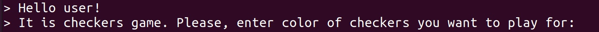
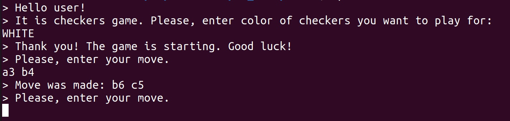
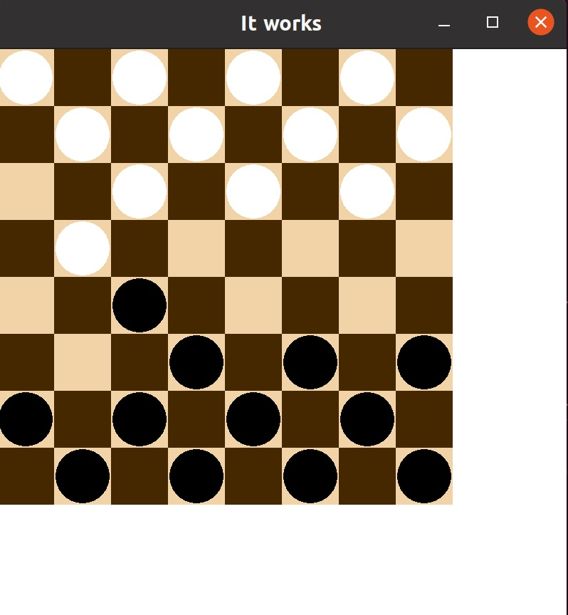
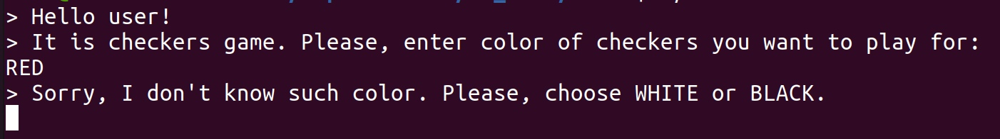
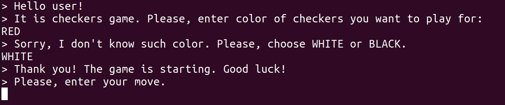
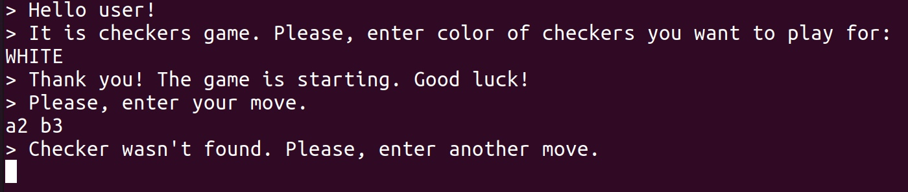
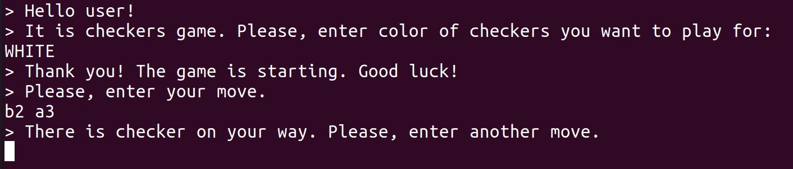

**Шашки**
=========

**Задание**
-----------
Реализуйте алгоритм для бота – игрока в шашки. Ваша программа должна уметь принимать ходы человека и делать ответные ходы.

**Инструкция по запуску**
-------------------------
Программа писалась под Linux, она требует SFML для графического вывода.

Чтобы запустить игру, выполните следующие инструкции из папки проекта:
<pre><code>
cd build
cmake ..
make
./main
</code></pre>

**Как игра работает**
---------------------
Прежде всего, игра вас поприветствует:

После того, как Вы введёте свой ход, скажем, `a3 b4`, игра его обработает, бот сделает свой ход, а затем попросит вас  снова сделать ход:

При этом на экране появится окошко, на котором отобразятся и Ваш ход, и ход соперника - бота:

Картинка обновляется после каждого хода, как Вашего, так и хода противника.

Игра будет продолжаться, пока не закончатся шашки.

**Обработка ввода**
-------------------
Если изначально Вы введёте неправильный цвет, это поймается, и нужно будет тот, который будет представлен на экране:

Соответственно, после ввода правильно цвета игра продолжится:

Если Вы попытаетесь пойти несуществующей шашкой, игра сообщит Вам об этом и попросит повторить ход:

Если же Вы сделаете попытку пойти на мето, где уже стоит пешка, Вам также это сообщат и попросят повторить ход:

Также, если вдруг Вы можете съесть хоть одну вражескую шашку, но не делаете этого, Вы увидите в консоли следующее сообщение:

`> You must eat enemy's checker. Please, enter anther move.`

После игры с Вами обязательно попощаются:

`> Thank you! The game is starting. Good luck!`

**Алгоритм**
------------

Приложение - это класс-синглетон `Application`. В своём запуске он создаёт новую игру - класс `Game`, в котором создаст игрока и бота, `Real_player` и `Bot` соответственно. Оба этих класса наследуются от базового класса Игрок - `Player`, в котором реализуются основные функции. В частности, класс `Real_player` переопределяет функцию `make_move` так, чтобы принимать ходы человека. 

Доску представляет класс `Chessboard`, содержащий массив клеток `Cell`, каждая из которых хранит указатель на шашку `Checker`, если она находится в этом поле.

Перед ходом и человека, и бота, проверяется, нет ли возможности у текущего игрока <<съесть>> чужую фигуру. Это реализовано посредством проверок всех чёрных диагоналей - так как шашки ходят по диагонали, а изначальные их позиции имеют чёрный цвет, то и в будущем на белые клетки они никогда не попадут. Все проверки диагоналей производятся рекурсивно, в процессе шашке, которая может атаковать, выставляет соответствующий флаг. После каждого хода флаги шашек сыгравшего игрока сбрасываются.

У шашки предусмотрены три состояния: `SIMPLE` (обычная шашка), `QUEEN`(дамка) и `DEAD`(мертва, её <<съели>>). Предусмотрено, что, превратившись в дамку, белые шашки станут чуть темнее, а чёрные - чуть светлее.

У бота предусмотрены уровни сложности - поле `level_` но на их реализацию не хватило времени. Однако планировалось, что в более сложном режиме бот будет делать ход либо той шашкой, которая ближе к уровню дамок, либо той, которая <<съест>> больше вражеских шашек.

